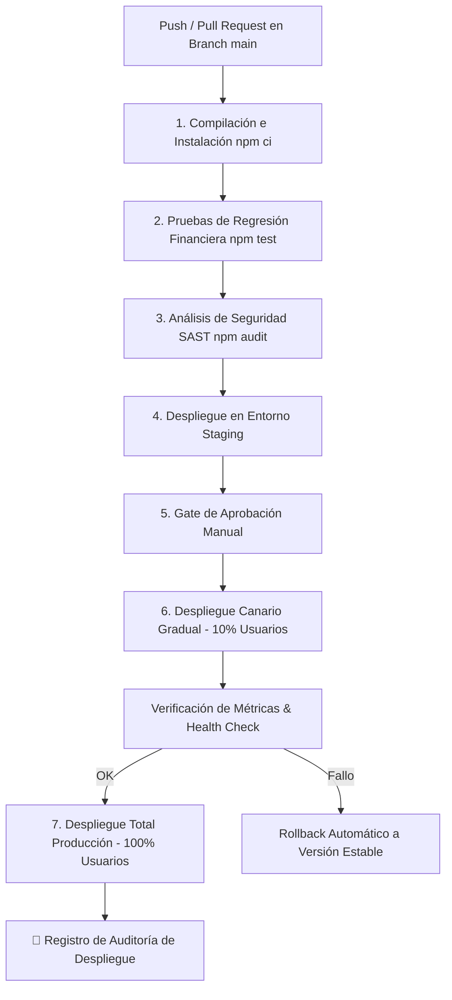

# Solución Integrada de CI/CD para PagaYa (Caso 4)

## 📌 Contexto del Problema y Diagnóstico

La billetera digital **PagaYa** experimentaba dos problemas críticos de despliegue:
1. **Cuello de Botella Operativo:** Las pruebas de regresión se realizaban de forma **manual durante 2 días completos** antes de cada release, imposibilitando la meta del negocio de publicar releases **quincenales** (2 al mes), limitándose a 1 al mes.
2. **Incidente Financiero en Producción:** Hace 3 meses se desplegó una versión sin pruebas completas donde un **error de redondeo** en punto flotante (`0.1 + 0.2`) alteró el saldo mostrado a **200 usuarios durante varias horas**.

---

## 🛠️ Arquitectura de los Pipelines Implementados

Para solucionar estos desafíos, se han implementado 3 pipelines listos para producción compatibles con **GitHub Actions**, **GitLab CI** y **Jenkins**.

---

## 📂 Archivos Creados en el Repositorio

| Archivo | Plataforma | Descripción |
| :--- | :--- | :--- |
| [`.github/workflows/ci-cd.yml`](file:///C:/Users/JENNIFER/OneDrive/Documentos/caso4_PagaYa/.github/workflows/ci-cd.yml) | GitHub Actions | Pipeline automatizado con multi-job, environments de GitHub, canary deployment y registro de auditoría. |
| [`Gitlab-ci.yml`](file:///C:/Users/JENNIFER/OneDrive/Documentos/caso4_PagaYa/.gitlab-ci.yml) | GitLab CI | Pipeline con stages declarativos, caché de dependencias, triggers manuales y publicación de artefactos. |
| [`Jenkinsfile`](file:///C:/Users/JENNIFER/OneDrive/Documentos/caso4_PagaYa/Jenkinsfile) | Jenkins | Pipeline declarativo con paso `input` para aprobación manual por Seguridad/DevOps y métricas JUnit. |
| [`scripts/audit-logger.js`](file:///C:/Users/JENNIFER/OneDrive/Documentos/caso4_PagaYa/scripts/audit-logger.js) | Node.js | Script automatizado para registrar eventos de auditoría (timestamp, commit hash, desplegador, entorno, porcentaje). |

---

## 💡 Justificación Técnica de la Solución

### 1. Habilitación de Releases Quincenales (en vez de Mensuales)
- **Eliminación del cuello de botella manual:** Las pruebas manuales de 2 días se reemplazan por un pipeline automatizado que ejecuta la suite de pruebas unitarias y de regresión en **menos de 3 minutos**.
- **Entrega Continua (CD):** El equipo puede integrar cambios diariamente a `main`, validar su calidad en Staging de forma automática y desplegar a producción sin esperar ciclos mensuales de prueba manual.

### 2. Prevención Total del Error de Redondeo (Caso de los 200 Usuarios)
- **Bloqueo Automático en Pipeline:** El stage `Pruebas de Regresión Financiera` ejecuta Jest cubriendo específicamente la función `round2(amount)` y la lógica de balances en [`src/wallet.js`](file:///C:/Users/JENNIFER/OneDrive/Documentos/caso4_PagaYa/src/wallet.js) y [`test/wallet.test.js`](file:///C:/Users/JENNIFER/OneDrive/Documentos/caso4_PagaYa/test/wallet.test.js).
- **Regla Inflexible:** Si un desarrollador introduce un cambio que rompa el cálculo de decimales (`round2(0.1 + 0.2)`), la prueba falla, el pipeline aborta la compilación inmediatamente y **ningún build defectuoso puede llegar a Staging ni a Producción**.

### 3. Mitigación de Riesgo mediante Despliegue Canario (Canary Release)
- **Rollout Gradual (10% -> 100%):** En lugar de actualizar a todos los usuarios simultáneamente, la nueva versión se entrega primero solo al 10% de los usuarios.
- **Limitación del Blast Radius:** En el hipotético caso de que surgiera una anomalía imprevista, el impacto afectaría como máximo al 10% de los usuarios durante minutos, en lugar del 100% durante varias horas como ocurrió en el incidente del pasado.
- **Rollback Inmediato:** Si el Health Check detecta métricas anómalas en el tráfico canario, la infraestructura revierte automáticamente el tráfico a la versión estable previa.

### 4. Gobernanza y Auditoría Financiera
- **Registro Inmutable de Auditoría:** Cada paso a Staging, Canario o Producción invoca [`scripts/audit-logger.js`](file:///C:/Users/JENNIFER/OneDrive/Documentos/caso4_PagaYa/scripts/audit-logger.js), dejando constancia inalterable en `logs/deployments_audit.log` con el timestamp exacto, usuario que aprobó el despliegue, commit SHA y estado final del despliegue.
- **Cumplimiento Normativo:** Satisface las exigencias de regulación para aplicaciones del sector fintech.
